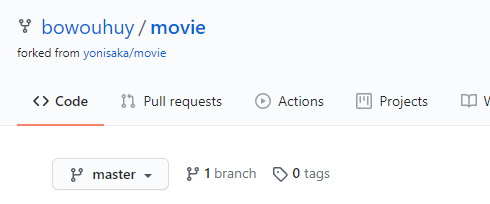
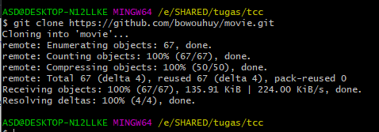
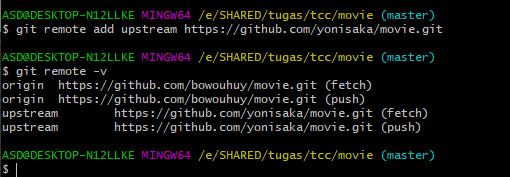
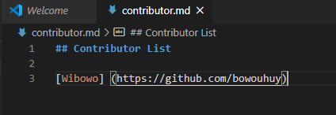
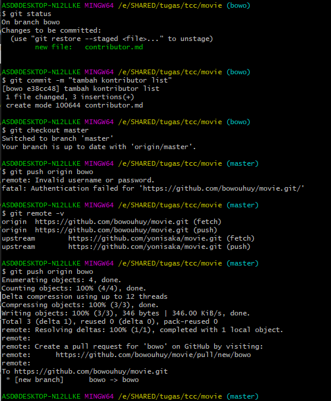
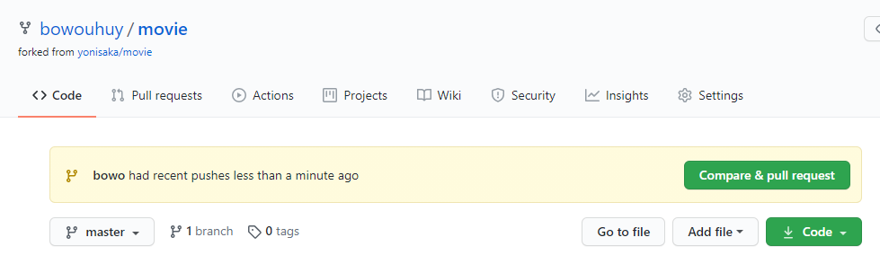
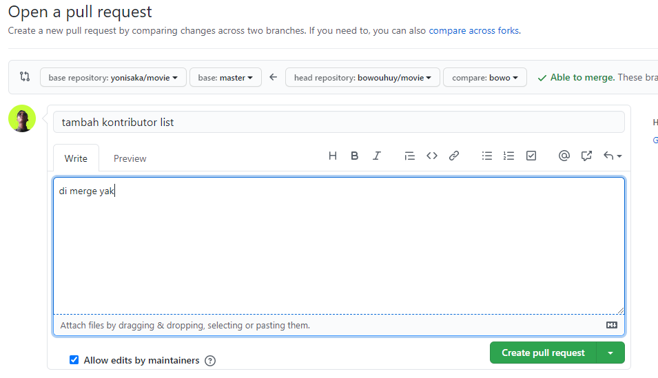
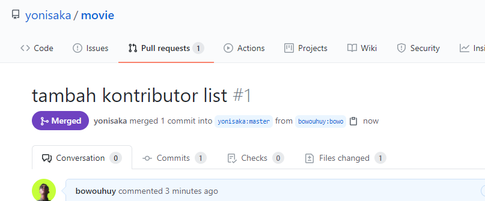

# Kolaborasi Git dan Github

Pada pertemuan pertama ini saya melakukan praktikum menggunakan git dan github dengan berkolaborasi dengan repo temean saya. saya melakukan fork kemudian melakukan pull request ke repo teman saya. untuk langkah langkahnya sebagai berikut.

1. Saya melakukan fork ke repo teman saya

    Kemudian tunggu proses fork sampai selesai 

2. Jika proses fork sudah berhasil maka otomatis di repository kita terdapat project tersebut. 

3. Selanjtnya melakukan clone project yang telah difork tadi

    
4. Kemudian menambahkan remote upstream dari repo teman saya

    
5. Kemudian melakukan kontribusi terhadap repo 

    
6. Setelah membuat branch baru untuk menampung perubahan file tersebut dengan menjalankan perintah git checkout –b bowo. Kita melakukan git add . dan melakukan git commit –m “message” ketika berada di branch bowo. Kemudian kembali lagi ke branch master dan kita push branch tersebut dengan menjalankan perintah git push origin add-contributor.

7. Kemudian cek diakun github  pada branch bowo dan tampilannya seperti berikut ini.

8. Supaya perubahan saya bisa terupdate, maka harus melakukan pull request.

    Isikan sebuah pesan sebelum pull request. kemudian klik pull request

9. Nah setelah dipull kita tinggal menunggu untuk di merge. berikut tampilan ketika sudah dimerge

Proses kolaborasi sudah selesai, disitu saya sudah berhasil berkontirbusi pada repo teman saya
