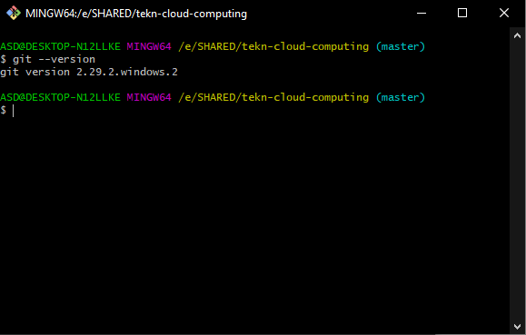
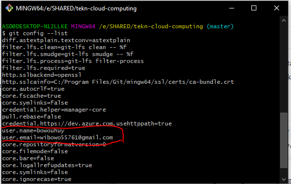

# Instalasi Git

[ [<< Kembali](README.md) ]

Bagian ini saya melakukan installasi git di windows, untuk step by stepnya cukup mudah, hanya dengan mengikuti instruksi yang ada maka git akan terinstall

Untuk membuka git bisa ke search dan cari Git disitu. atau bisa juga dengan menggunakan klik kanan pada folder lalu Git Bash here untuk membuka git pada direktiri tersebut.

Untuk mencoba test kalau git sudah terinstall bisa menggunakan perintah

```sh
$ git --version
```


Untuk installasinya kurang lebih seperti itu dan cukup mudah dipahami dengan hanya membaca instruksi saat installasi.


# Konfigurasi Git

Agar dapat melakukan push ke repositori di github kita perlu mengkonfigurasi username dan email github kita ke komputer lokal, agar nantinya dapat dikenali.

Untuk konfigurasinya yaitu dengan perintah berikut :
```sh
$ git config --global user.name "bowouhuy"
$ git config --global user.email wibowo55761@gmail.com
```

Isian diatas harus sesuai dengan konfig akun kita yang ada pada github. Untuk bisa melihat konfigurasi yang sudah dilakukan di kmputer lokal bisa dengan menggunakan perintah:

```sh
$ git config --list
```

Nanti akan muncul list konfigurasi di komputer kita : 



Konfigurasi ini cukup dilakukan sekali saja.
