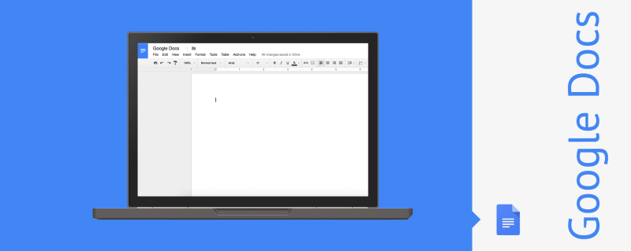
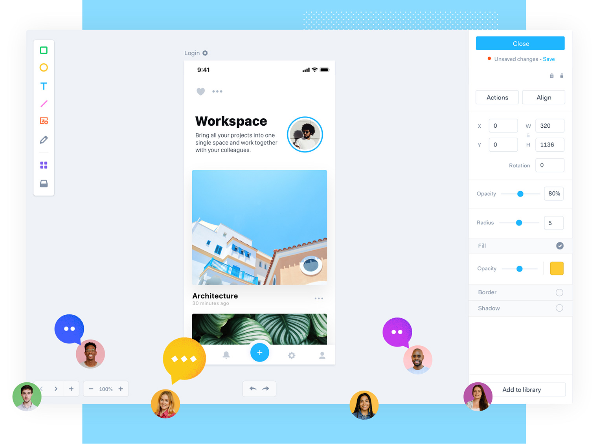
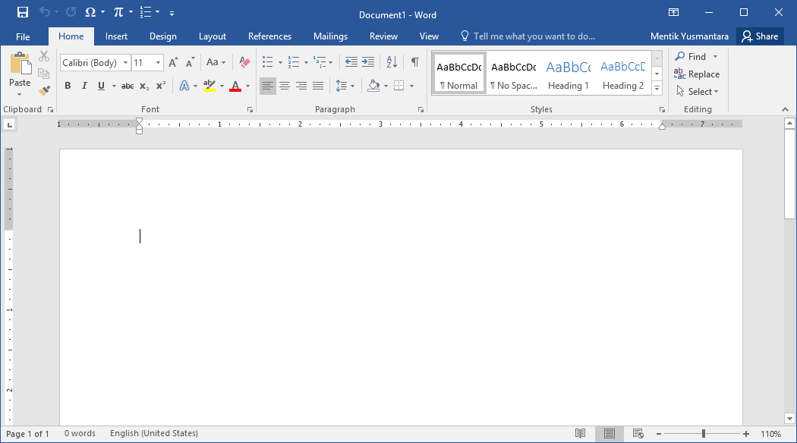
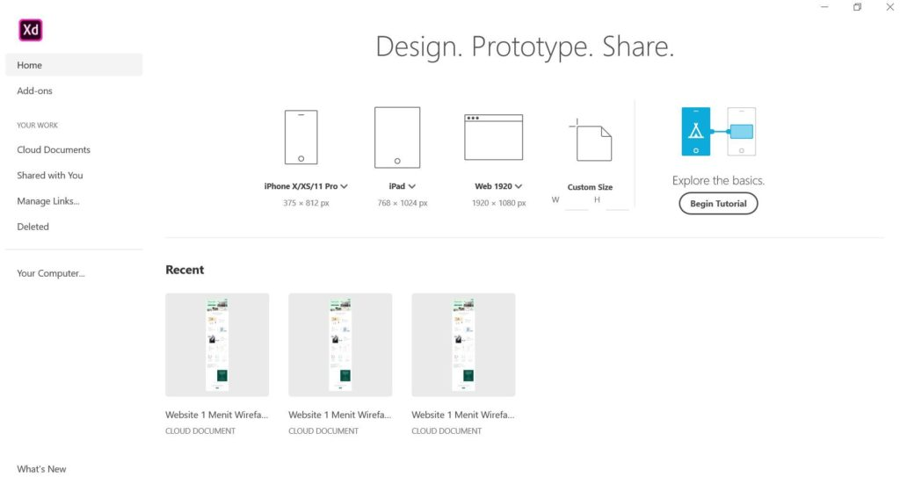

## Layanan Saas

#### Saas

##### 1. Google Docs

Google Docs adalah salah satu fasilitas Google yang sengaja di buat untuk menyimpan dokumen dokumen yang anda miliki, artinya anda dapat menggunakan Google docs untuk menyimpan data cadangan anda. Contohnya kalau laptop atau komputer anda rusak, anda tidak terlalu bingung karna di Google docs semua data anda tersimpan dengan aman dan tanpa ada yang berubah sedikitpun.

 

Berikut ini adalah beberapa Keunggulan menggunakan Google Docs :

* Real time collaboration: 50 orang dapat bekerja dalam satu berkas dalam satu waktu. * Meningkatkan produktivitas.
* Tidak perlu file dengan berbagai versi. Meningkatkan efisiensi.
* Setiap perubahan disimpan secara otomatis.
* Aman: menyimpan berkas penting atau tugas sekolah tidak takut hilang atau rusak atau terkena virus.

#### 2. Marvel

Marvel adalah aplikasi berbasis web yang membuat Anda dapat membuat prototype tanpa harus melakukan pemrograman. Ini adalah aplikasi paling mudah untk mengubah sketsa, gambar dan mockup menjadi prototype aplikasi smartphone atau website.

### SaaS Non Cloud

#### 1. Microsoft Word

Microsoft Word adalah sebuah program yang merupakan bagian dari paket instalasi Microsoft Office, berfungsi sebagai perangkat lunak pengolah kata meliputi membuat, mengedit, dan memformat dokumen. Perangkat lunak pengolah kata atau word processing adalah program yang digunakan untuk mengolah dokumen berupa teks misalnya surat, kertas kerja, brosur, kartu nama, buku, jurnal, dan lain-lain.

#### 2. Adobe XD

Adobe XD adalah sebuah alat yang disediakan gratis oleh Adobe untuk desain UI / UX dan prototyping berbagai platform termasuk web, ponsel, tablet, dan lainnya. Hal pertama yang akan Anda perhatikan ketika membuat aplikasi adalah start screen. Sebagai pengguna baru Adobe XD, saya sangat menyarankan mengklik tombol Begin Tutorial. Dimana Anda akan dibawa ke layar dengan panel yang menjelaskan proses menggunakan Adobe XD.