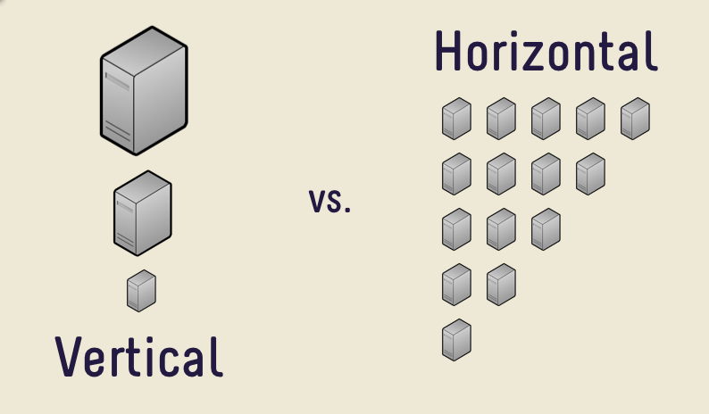

# Rangkuman

### Perbedaan Saas Iaas dan Paas

Software as a Service (SaaS), layanan Cloud pada jenis ini disediakan dalam bentuk perangkat lunak. Contoh dari SaaS adalah Google Apps (Docs, Spreadsheet, dll), Office 365, dan Adobe Creative Cloud. Pada Layanan SaaS pengguna layanan hanya perlu menggunakan aplikasi tersebut tanpa harus mengerti dan mengurus bagaimana data disimpan atau bagaimana aplikasi tersebut di maintenance, karena hal tersebut merupakan service yang disediakan penyedia layanan.

Platform as a Service (PaaS), layanan Cloud pada jenis ini disediakan dalam bentuk platform yang dapat dimanfaatkan pengguna untuk membuat aplikasi diatasnya. Contoh PaaS adalah Amazon Web Service, Microsoft Azure, Facebook, dll. Hal-hal yang dapat dilakukan pengguna layanan PaaS adalah membangun aplikasi, upload aplikasi, testing, dan mengatur konfigurasi.

Infrastructure as a Service (IaaS), layanan Cloud jenis IaaS pada dasarnya adalah fisik kotak server dan komputer virtual. IaaS menyediakan perusahaan dengan sumber daya komputasi meliputi server, jaringan, storage dan ruang data center.

### Arsitektur SaaS

Dengan model ini, satu versi aplikasi, dengan konfigurasi tunggal digunakan untuk semua pelanggan. Aplikasi diinstal pada beberapa mesin untuk mendukung skalabilitas (disebut penskalaan horizontal). Dalam beberapa kasus, versi kedua dari aplikasi diatur untuk menawarkan kelompok pelanggan tertentu dengan akses ke versi pra-rilis aplikasi untuk tujuan pengujian. Dalam model tradisional ini, setiap versi aplikasi didasarkan pada kode unik. Meskipun pengecualian, beberapa solusi SaaS tidak menggunakan multitenancy, untuk mengelola sejumlah besar pelanggan secara hemat biaya. Apakah multitenancy merupakan komponen yang diperlukan untuk perangkat lunak sebagai layanan adalah topik kontroversi.

Ada dua jenis utama SaaS:

SaaS Vertikal
Perangkat lunak yang menjawab kebutuhan industri tertentu (misalnya, perangkat lunak untuk perawatan kesehatan, pertanian, real estat, industri keuangan)

SaaS Horisontal
Produk yang berfokus pada kategori perangkat lunak (pemasaran, penjualan, alat pengembang, SDM) tetapi bersifat agnostik industri.

### Fitur Utama dan Manfaat SaaS

Solusi SaaS memiliki fitur yang berbeda dengan yang ada pada aplikasi yang lebih tradisional yang diinstal pada desktop Anda misalnya, berikut adalah beberapa manfaat lain yang dapat dihasilkan dari penerapan produk berbasis SaaS.

Kesederhanaan
Aplikasi perangkat lunak yang dirancang sebagai solusi SaaS biasanya diakses melalui web melalui berbagai jenis perangkat. Kemajuan dalam bahasa pemrograman sisi klien seperti JavaScript telah menghasilkan antarmuka web yang lebih intuitif dan dengan demikian, membuat penggunaan aplikasi yang dikirimkan melalui internet semudah digunakan sebagai aplikasi desktop.

Ekonomis
Model pembayaran biaya subskrip bulanan atau tahunan memudahkan bisnis untuk menganggarkan, memasangkan ini dengan biaya penyiapan infrastruktur nol, mudah untuk melihat bagaimana memilih untuk menggunakan solusi SaaS dapat menghemat uang bisnis.

Keamanan
Keamanan adalah aspek penting dari solusi pengembangan perangkat lunak dan platform SaaS juga demikian. Sebagai konsumen aplikasi yang dirancang menggunakan SaaS, Anda tidak perlu khawatir tentang bagaimana data Anda dikunci. Dipegang dengan aman di awan!

Kesesuaian
Dengan penginstalan perangkat lunak tradisional, pembaruan dan tambalan terkadang memerlukan banyak waktu dan uang. Hal ini terutama berlaku di perusahaan. Selain itu, perbedaan versi antara anggota tim dari tenaga kerja Anda dapat menyebabkan masalah kompatibilitas dan bahkan lebih banyak waktu yang terbuang. Dengan SaaS, pelanggan dapat dengan mudah masuk ke layanan yang sudah ditingkatkan.

##### Referensi
* https://www.quora.com/What-is-the-difference-between-IaaS-SaaS-and-Paas
* https://hackernoon.com/saas-software-as-a-service-platform-architecture-757a432270f5
* https://www.devteam.space/blog/saas-software-as-a-service-platform-architecture/
* https://usersnap.com/blog/cloud-based-saas-architecture-fundamentals/