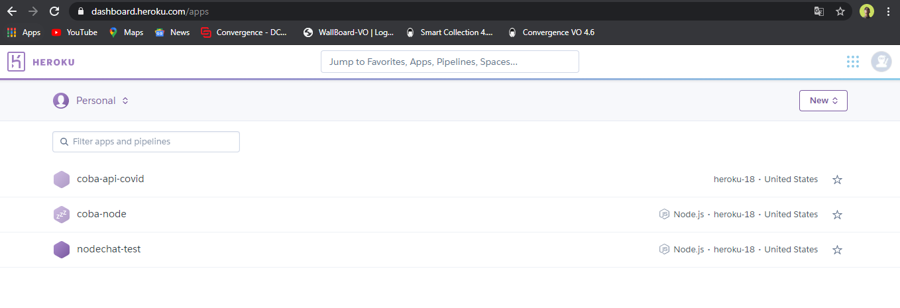
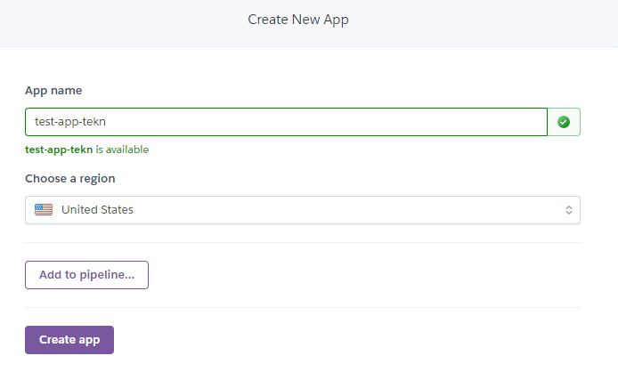
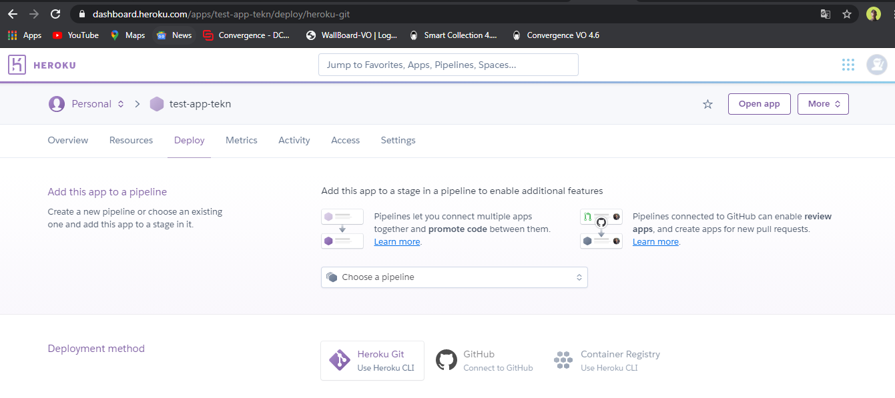

### Membuat app melalui dashboard heroku

Pertama Login ke heroku

Setelah berhasil login klik tombol new -> create new app di sebelah kanan atas

Setelah itu akan diarahkan ke form new app. isi nama app dan region kemudian klik create app

Setelah itu aplikasi kita sudah berhasil dibuat di heroku

