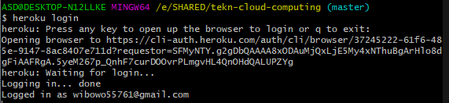
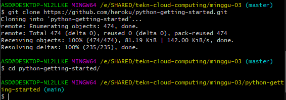
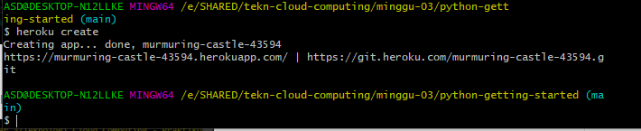
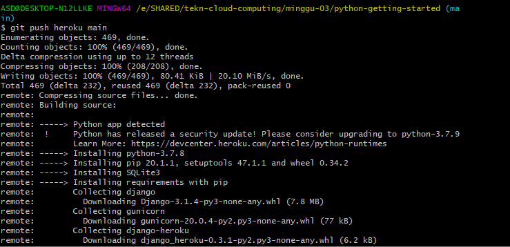

### Getting Started on Heroku with Python

##### 1. Melakukan Login ke heroku

##### 2. Melakukan clone app dari github

##### 3. Membuat app baru di heroku

##### 4.  Melakukan Push project dari lokal ke heroku

##### 5. Membuka Project
